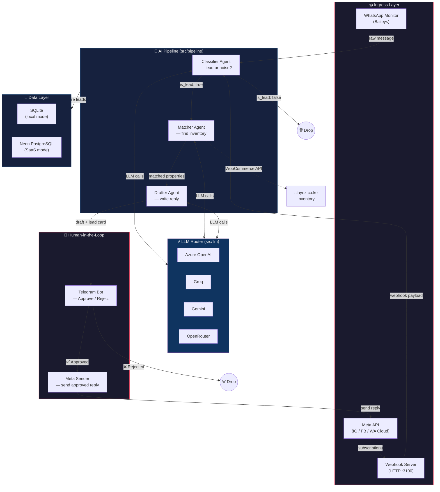

# StayEZ WhatsApp Lead Monitor & Chatbot

A Node.js worker for a Kenyan short-stay property broker.

The system monitors WhatsApp groups and DMs, detects accommodation requests, searches the StayEZ inventory, drafts personalized responses, and notifies the broker via Telegram. It keeps the broker in the approval loop by sending drafts instead of auto-replying.

## Architecture



### Component Table

| Component | Role |
| --- | --- |
| `src/agents/monitor.js` | Maintains the WhatsApp connection via Baileys and emits candidate messages. |
| `src/adapters/webhook-server.js` | HTTP server receiving Meta (IG/FB/WA Cloud) and TikTok webhook payloads. |
| `src/pipeline/index.js` | Orchestrator — filters, classifies, matches, drafts, stores, and sends Telegram cards. |
| `src/llm/router.js` | Routes LLM calls across Azure OpenAI, Groq, Gemini, and OpenRouter with fallback. |
| `src/stayez/api.js` | Queries StayEZ/WooCommerce inventory APIs for property matching. |
| `src/db/index.js` | SQLite store for leads and hosts (local mode). |
| `src/db/pg.js` | Neon PostgreSQL connection (SaaS multi-tenant mode). |
| `src/db/tenant.js` | Loads per-tenant config (API keys, session IDs, keyword filters) from PostgreSQL. |
| `src/ui/dashboard-auth.js` | Verifies dashboard actors and enforces system-owner / tenant role boundaries. |
| `src/telegram/index.js` | Sends human-review cards with Approve/Reject buttons to the broker. |
| `src/agents/meta-sender.js` | Sends approved replies back via the Meta Graph API. |

## Setup

1. **Install dependencies:**
   ```bash
   npm install
   ```

2. **Configure environment variables:**
   Copy `.env.example` to `.env` and fill in your credentials.
   ```bash
   cp .env.example .env
   ```

3. **Run the healthcheck:**
   ```bash
   npm test
   npm run healthcheck
   ```

4. **Start the worker:**
   ```bash
   npm start
   ```
   *Scan the QR code printed in the terminal to link your WhatsApp account.*

## Docker

```bash
docker compose up --build
```

The container stores SQLite and WhatsApp auth state under `DATA_DIR`, which defaults to `/app/data` in Docker and is mounted as a named volume by `docker-compose.yml`.

## Features
- **Read-Only WhatsApp Monitor:** Silently monitors messages without auto-replying.
- **LLM Fallback Chain:** Uses a 5-level fallback chain (Azure OpenAI, Groq, Gemini, OpenRouter, Ollama) for high availability.
- **Property Matching:** Queries the live `stayez.co.ke` WooCommerce inventory via REST APIs.
- **Telegram Notifications:** Sends drafted messages securely to the broker via Telegram cards.
- **Operations Dashboard:** Visit `/admin` or `/tenant` on the webhook server to review tenants, leads, contacts, drafts, usage, and configuration.
- **Dashboard Auth & Tenant Isolation:** Production dashboard API access should use verified Clerk JWTs. `PLATFORM_OWNER_EMAILS` users can access admin APIs; tenant users are scoped through `organization_users` and only see organizations where they have an active role. `DASHBOARD_TOKEN` is a local/internal fallback only when Clerk is not configured.

## Dashboard Access

For SaaS mode, apply `src/db/schema_pg.sql` so `app_users` and `organization_users` exist, then configure:

```bash
DASHBOARD_REQUIRE_AUTH=true
CLERK_JWKS_URL=https://<your-clerk-domain>/.well-known/jwks.json
CLERK_JWT_ISSUER=https://<your-clerk-domain>
CLERK_SECRET_KEY=<from Clerk dashboard>
CLERK_PUBLISHABLE_KEY=<pk_live_or_pk_test_from Clerk dashboard>
PLATFORM_OWNER_EMAILS=admin@example.com
```

The backend validates Clerk tokens and the static dashboard uses `CLERK_PUBLISHABLE_KEY` to render Clerk sign-in and send `Authorization: Bearer <Clerk session token>` on API requests. If `CLERK_JWKS_URL` is not set, the API falls back to `DASHBOARD_TOKEN`; use that only for local/internal testing.

Tenant users must have an active `organization_users` row. System owners can use `/admin`; tenant users are blocked from `/api/admin/*` and can only access their assigned `organization_id`.

## Scripts
- **Add Local Host:** Manually add a local host to the SQLite database.
  ```bash
  node scripts/add-host.js
  ```

## Deployment

See [docs/coolify-deployment.md](docs/coolify-deployment.md) for the recommended Coolify deployment path.
See [docs/azure-hosting.md](docs/azure-hosting.md) for an Azure Container Apps alternative.

## Known Limitations

- This is a single-worker service because SQLite and the WhatsApp session are local state.
- The current healthcheck is a command, not an HTTP endpoint.
- Prompt-injection, guardrail, and evaluation tests should be added before production use.
